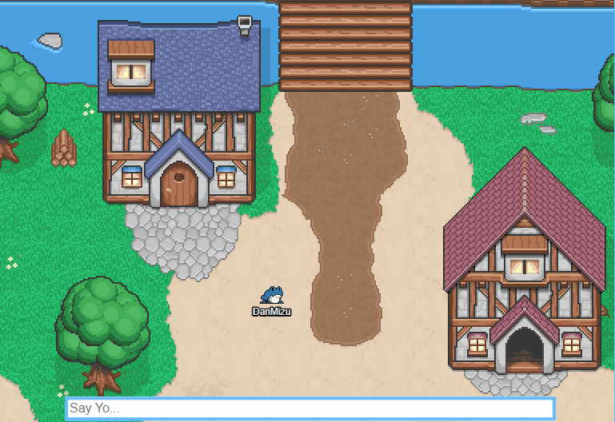

# Project Virtual Pond

**A Physical Space for Twitch Frogs to Hang and Chat.**

A Virtual World game written in HTML/CSS/JS using the Socket.io and Phaser framework. Firebase for the database and Node.js for server management.

### Planned:
- Minigames
- Character Customization
- Twitch Emotes in Messages

### Tests:

**Player Movement/Direction + Color Changing**

**Chat Messaging**

**NPC Interactions**

