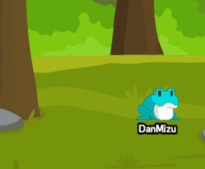
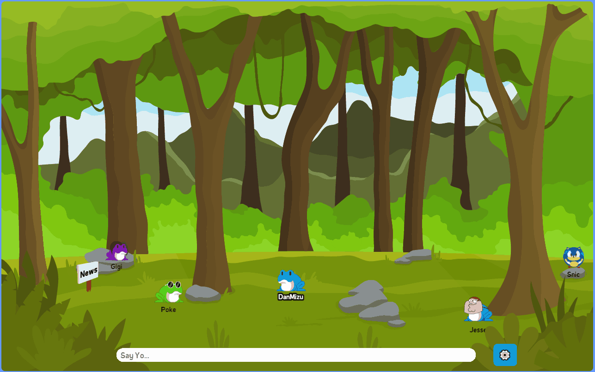

<p align="center">
  <a align="center" href='https://pond.danmizu.dev/'/>
    
  </a>
</p>

---

<p align="center" style="font-weight: bold;">
    A Social Virtual World for Twitch Frogs to Hang and Chat.
</p>

<p align="center">
    Written in HTML/CSS/JS using Node.js, Socket.io, Firebase, and Phaser3.
</p>


<p align="center">
    <a href="https://github.com/Dan-Mizu/Project-Virtual-Pond/issues">
        
    </a>
    <a href="https://github.com/Dan-Mizu/Project-Virtual-Pond/commits">
        
    </a>
    <a href="https://discord.gg/2aVq8qmcSr">
        
    </a>
    <a href="https://trello.com/b/2EppX5wM/project-virtual-pond">
        
    </a>
</p>


<p align="center">
    <a href="https://pond.danmizu.dev/">
        
    </a>
    <a href="https://pte.danmizu.dev/">
        
    </a>
</p>


<p align="center">
    <a href="https://ko-fi.com/C0C37J4MF">
        
    </a>
</p>


---


<p align="center"> <h3 style="text-align: center;">Player Movement</h3> </p>
<p align="center">  </p>

<p align="center"> <h3 style="text-align: center;">Character Creator</h3> </p>
<p align="center">  </p>

<p align="center"> <h3 style="text-align: center;">Chatting</h3> </p>
<p align="center">  </p>

<p align="center"> <h3 style="text-align: center;">NPCs</h3> </p>
<p align="center">  </p>


---


## Longterm Goals:
- [ ] Several Minigames both Singleplayer and Multiplayer
- [ ] Complete Character Customization
- [ ] Extensive Chat Features including Twitch Emotes
- [ ] Player Housing
- [ ] Character Progression


---


## Contribute:

There are two ways to contribute. 


### Donations

I am currently working alone on this project- creating both the assets and the code. I do not have a job and am attending university, so any donations would help a ton. I could use the money to hire artists, since art is not my strong suite and I want this game to be the best it could be.

[](https://ko-fi.com/C0C37J4MF)

### Developing

If you know how to develop web frontend and/or Node.js backend, then you can fork this repository and make changes and we can push them on this main repo. Reach out to me on Discord (Dan Mizu#8420) if you are interested.

1. **Install Node.js, NPM, and nodemon**

You most likely have these already if you know what you're doing. Nodemon allows the server to automatically restart itself after detecting changes to the code.

1. **Fork this Repo**

Theres a button for this at the top of this repo.

2. **Clone the forked Repo**

I personally use Github Desktop to clone repos.

3. **Open a Terminal at your Local Environment**

Open a console/terminal at the directory where the cloned repo lives on your PC. 

4. **Install Dependencies**

```
npm install
```

5. **Fill out config.json**

Open the project in your IDE of choice (I use Visual Studio Code). Go to the `/server/config/` directory. Copy the `config_example.json` file and rename the new one to just `config.json`. Set "port" to "80". You'll need to create a firebase realtime database and twitch developer application, and copy their keys to the appropriate strings in the config. If you need any help with this, DM me on Discord (Dan Mizu#8420).

6. **Run Node.js server**

```
npm start
```

7. **Develop**

Any changes you now make will automatically restart the server. Access the game with `localhost:<specified port in config>` in your browser. If you dont know what to start working on, please check the Trello cited above in the links section and look for planned and unfinished features/mechanics that you would like to contribute to.

8. **Submit Changes For Review**

When you're finished implementing a new feature/mechanic, push your changes and submit them for review. This process is detailed here: https://github.com/firstcontributions/first-contributions.