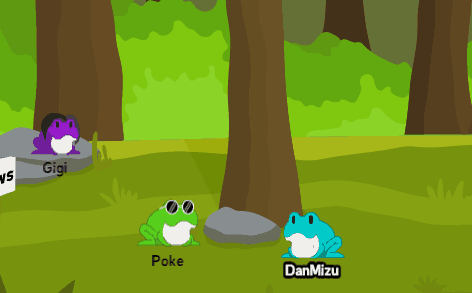

  

    <b>A Social Virtual World for Twitch.</b>

    Written in TypeScript, using Phaser 3, Vite, Firebase, & Colyseus.

    
    

    
    

    
    
</a>

---

    <h3>Player Movement</h3>
    

    <h3>Character Creator</h3>
    

    <h3>Chatting</h3>
    

    <h3>NPCs</h3>
    

---

## Longterm Goals:

-   [ ] Several Minigames both Singleplayer and Multiplayer
-   [ ] Complete Character Customization
-   [ ] Extensive Chat Features including Twitch Emotes
-   [ ] Player Housing
-   [ ] Character Progression

---

## Contribute:

There are two ways to contribute.

### Donations

I am currently working alone on this project- creating both the assets and the code. I do not have a job and am attending university, so any donations would help a ton. I could use the money to hire artists, since art is not my strong suite and I want this game to be the best it could be.

    

### Developing

Javascript/Typescript is a relatively simple language and is very easy to develop with. This project uses the Phaser game framework which makes it really easy to use JS knowledge to make a game for the web.

1. **Install Node.js, and Visual Studio Code**

You can install Node.JS from <https://nodejs.org/en/>

The LTS is fine. It should also install npm (a package manager) as well.

Visual Studio Code is a great editor for web development and is obtained at <https://code.visualstudio.com/>

1. **Fork this Repo**

Theres a button for this at the top of this repo.

2. **Clone the forked Repo**

I personally use the Github Desktop app to clone repos attached to my profile easily.

3. **Open the Repo in Visual Studio Code and install Dependencies**

You can open the repo directly from Github Desktop into VSCode after its been cloned. You can install dependencies either by running `npm install` in the terminal embedded in VSCode or by running the Install Dependencies task.

4. **Develop**

-   server/src: Server Files
-   client/src: Game Client Files
-   client/public/assets: Game Assets
-   client/src/page/index.html: Main Page
-   client/src/index.ts: Inits the Phaser 3 Game
-   client/src/scene/Game.ts: Main Game World Scene

I recommend skimming through it all to understand how it works.

5. **Submit Changes For Review and Merging**

When you're finished implementing a new feature/mechanic, push your changes to your repo and then submit them for review. This process is detailed here: <https://github.com/firstcontributions/first-contributions>.
